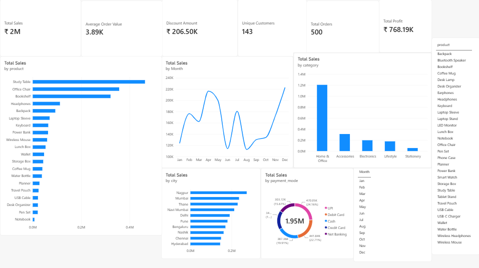

# Sales & Customer Analytics Dashboard — 2025

An end-to-end sales and customer analytics project built using **Excel, MySQL, Power BI and DAX**.

## 📊 Dashboard

## 🛠️ Tools & Technologies

- **Microsoft Excel** — Data preparation and validation
- **MySQL** — Data storage and SQL analysis
- **Power BI** — Interactive dashboard and visualization
- **DAX** — Calculated measures and business metrics

## 📁 Dataset

The project uses a fictional sales dataset containing **500 sales transactions** from 2025.

The dataset includes:

- Order ID
- Order Date
- Customer ID
- Customer Name
- City
- Product
- Quantity
- Unit Price
- Discount
- Payment Mode

A separate product master table contains product categories and unit costs.

## 📈 Dashboard Analysis

The Power BI dashboard includes:

- Total Sales
- Total Profit
- Total Orders
- Unique Customers
- Average Order Value
- Discount Amount
- Sales by Product
- Sales by Category
- Sales by Month
- Sales by City
- Sales by Payment Mode
- Month filter
- Product filter

## 🔢 Key Metrics

| Metric | Value |
|---|---:|
| Total Sales | ₹1,945,773.92 |
| Total Orders | 500 |
| Unique Customers | 143 |
| Average Order Value | ₹3,891.55 |
| Discount Amount | ₹206,498.78 |

## 🔍 SQL Analysis

MySQL was used to analyze:

- Overall sales performance
- Sales by city
- Sales by product category
- Top-selling products
- Monthly sales trends
- Payment mode performance
- Customer-level sales
- Profit by category
- Average Order Value
- Customer counts

## 📌 Key Insights

- **Home & Office** generated the highest category sales.
- **Study Table** was the highest-selling product by net sales.
- **Nagpur** recorded the highest city-level sales.
- **December** recorded the highest monthly sales.
- **UPI** generated the highest sales among the payment modes.
- The dataset contains **143 unique customers across 500 orders**.

## 📂 Project Files

- `Sales_Customer_Analytics_Dataset.xlsx` — Main sales dataset
- `Product_Master.csv` — Product, category and cost information
- `sales_analysis.sql` — SQL queries used for analysis
- `dashboard_screenshot.png` — Power BI dashboard preview
- `SalesAnalytics.pbix` — Power BI report file

## 🎯 Project Objective

The objective of this project was to practice an end-to-end data analytics workflow:

**Excel → MySQL → SQL Analysis → Power BI → DAX → Interactive Dashboard**

This project demonstrates practical skills in data preparation, SQL analysis, data modeling, business metrics and data visualization.
